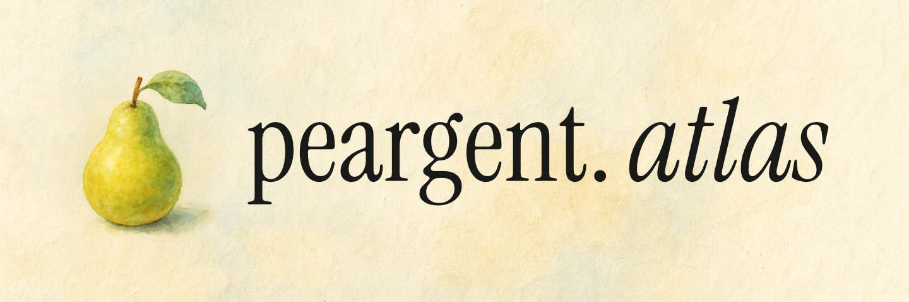

<p align="center">
  
</p>

# Peargent Atlas

[](https://opensource.org/licenses/Apache-2.0)
[](https://nextjs.org/)

The visual builder for [Peargent](https://github.com/Peargent/peargent) agents. Design, route, and orchestrate complex agent behaviors with an interactive node-based interface.

## Features

- **Visual Design** - Drag-and-drop interface to build complex agent architectures
- **Orchestration** - Define Agent Pools, Routers, and Tools visually
- **Export to Code** - Generate `.pear` files compatible with the Peargent CLI
- **Real-time Validation** - Instant feedback on connection logic and configuration
- **Multi-Tab Interface** - Work on multiple agent systems simultaneously
- **Responsive** - Fully functional on desktop and mobile devices

## Running Locally

1. Clone the repository:
```bash
git clone https://github.com/Peargent/peargent-atlas.git
cd peargent-atlas
```

2. Install dependencies:
```bash
npm install
```

3. Run the development server:
```bash
npm run dev
```

4. Open [http://localhost:3000](http://localhost:3000) in your browser.

## Tech Stack

- **Next.js 15** - React framework
- **React Flow** - Graph visualization
- **Tailwind CSS** - Styling
- **Framer Motion** - Animations
- **TypeScript** - Type safety

## Contributing

Contributions are welcome! Please join our [Discord](https://discord.gg/jtNvmjMAYu) to discuss new features or report bugs. Contribution Guidelines are available [here](CONTRIBUTING.md).

## License

Apache License 2.0 - see [LICENSE](LICENSE) file for details.
